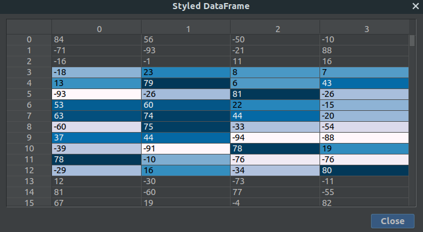
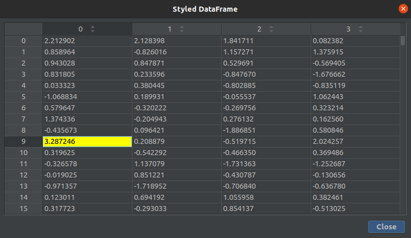
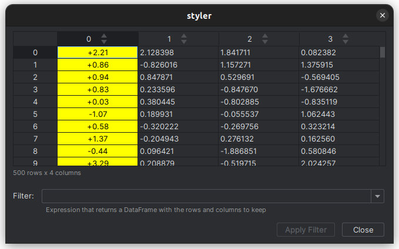
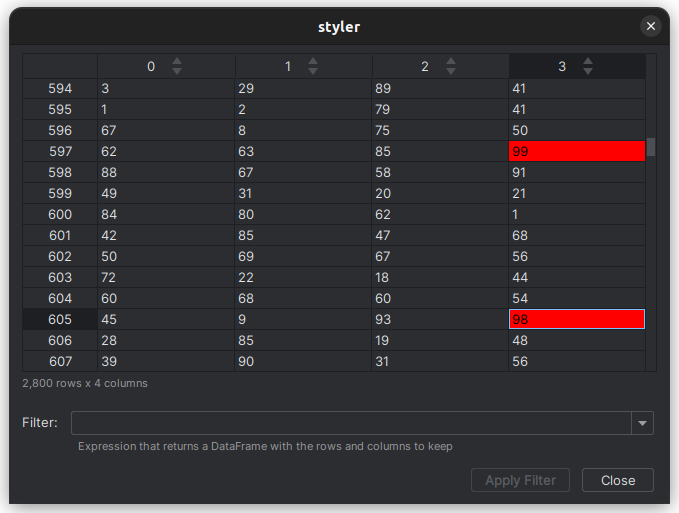
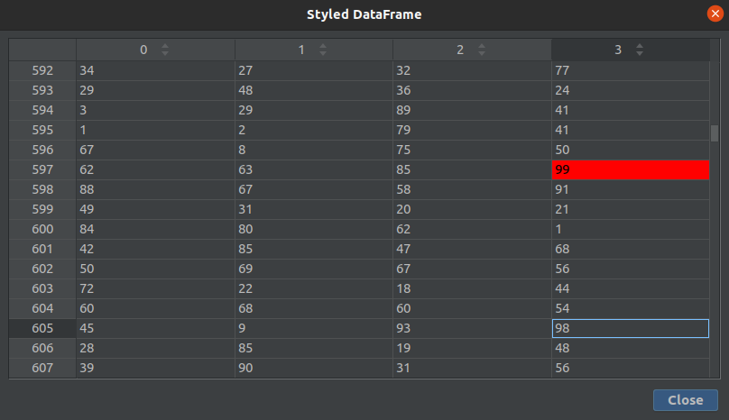

# Python: Styled DataFrame Viewer

Download from JetBrains Marketplace: [Python: Styled DataFrame Viewer](https://plugins.jetbrains.com/plugin/16050-python-styled-dataframe-viewer)

**pandas 1.3:** Is now supported.

## What It Is
View styled [pandas](https://pandas.pydata.org/docs/getting_started/index.html) `DataFrames` when debugging.

Apply conditional formatting and visual styling in your Python code, by using `DataFrames.style`.
The configured style is used to render a styled output of the `DataFrame`.



#### Supported Styler Methods
The following `Styler` methods are supported:

  |pandas Styler method|plugin support for pandas version|
  |---|---|
  |[Styler.apply](https://pandas.pydata.org/pandas-docs/stable/reference/api/pandas.io.formats.style.Styler.apply.html)|1.1.x - 1.3.x|
  |[Styler.applymap](https://pandas.pydata.org/pandas-docs/stable/reference/api/pandas.io.formats.style.Styler.applymap.html)|1.1.x - 1.3.x|
  |[Styler.background_gradient](https://pandas.pydata.org/pandas-docs/stable/reference/api/pandas.io.formats.style.Styler.background_gradient.html)|1.1.x - 1.3.x|
  |[Styler.format](https://pandas.pydata.org/pandas-docs/stable/reference/api/pandas.io.formats.style.Styler.format.html)|1.1.x - 1.3.x|
  |[Styler.highlight_between](https://pandas.pydata.org/pandas-docs/stable/reference/api/pandas.io.formats.style.Styler.highlight_between.html)|1.3.x (added in 1.3.0)|
  |[Styler.highlight_max](https://pandas.pydata.org/pandas-docs/stable/reference/api/pandas.io.formats.style.Styler.highlight_max.html)|1.1.x - 1.3.x|
  |[Styler.highlight_min](https://pandas.pydata.org/pandas-docs/stable/reference/api/pandas.io.formats.style.Styler.highlight_min.html)|1.1.x - 1.3.x|
  |[Styler.highlight_null](https://pandas.pydata.org/pandas-docs/stable/reference/api/pandas.io.formats.style.Styler.highlight_null.html)|1.1.x - 1.3.x|
  |[Styler.highlight_quantile](https://pandas.pydata.org/pandas-docs/stable/reference/api/pandas.io.formats.style.Styler.highlight_quantile.html)|1.3.x (added in 1.3.0)|
  |[Styler.set_properties](https://pandas.pydata.org/pandas-docs/stable/reference/api/pandas.io.formats.style.Styler.set_properties.html)|1.1.x - 1.3.x|
  |[Styler.text_gradient](https://pandas.pydata.org/pandas-docs/stable/reference/api/pandas.io.formats.style.Styler.text_gradient.html)|1.3.x (added in 1.3.0)|


> A good overview about styling `DataFrames` can be found on the pandas website: [pandas User Guide: Styling](https://pandas.pydata.org/pandas-docs/stable/user_guide/style.html)

## How Does It Work
Generate a `DataFrame` and configure the `Styler` returned by `DataFrame.style`:
```python
import numpy as np
import pandas as pd

np.random.seed(123456789)

# create a DataFrame
df = pd.DataFrame(np.random.randn(500, 4))

# the Styler highlights the maximum value in each column
styler = df.style.highlight_max(axis='index')

breakpoint()
```
When you run the code in debug mode in IntelliJ, the program stops at the line with the `breakpoint()` command.

Select the `Debugger` tab (as seen in the screenshot below). Now you can see all the variables of the current stackframe listed. In this case the variables
`df` and `styler`. Right click on `styler` to open the context menu. Select `View as Styled DataFrame`.


This opens a new window which shows the styled output of the `DataFrame` `df` using the configured `styler`:



You can also right click on the `df` in the `Debugger` and select `View as Styled DataFrame`. In that case all values are displayed without applied styles.

### Supported CSS Properties
The following css-properties are supported by the plugin:

|css-property|mapping|
|---|---|
|`color`|table cell text color|
|`background-color`|table cell background color|
|`text-align`|align cell text (supported values are: `left`, `right` and `center`)|

All other properties are ignored.

> Inheritance of css properties is only partial implemented and may not work for all scenarios.
This may be improved if there are major problems with it.

## Version History
|version|changelog|
|---|---|
|0.4.0|[link](./docs/0.4.0/changelog.md)|
|0.3.1-b.1|[link](./docs/0.3.1-b.1/changelog.md)|
|0.3-b.1|initial release|

## Examples
#### About The Code Snippets
All code snippets on this page are intentionally chosen very minimalistic to demonstrate the possibilities of the plugin.

The `breakpoint()` command in the snippets require at least Python 3.7.

### Format Displayed Values
You can also format the displayed data as you like:
```python
import numpy as np
import pandas as pd

np.random.seed(123456789)

# create a DataFrame
df = pd.DataFrame(np.random.randn(500, 4))

# the Styler formats all values of the first column
styler = df.style\
    .format({0: '{:+.2f}'})\
    .set_properties(**{'text-align': 'center', 'background-color': 'yellow'}, subset=[0])

breakpoint()
```

Right click on styler in the `Debugger` tab to open the context menu. Select `View as Styled DataFrame`:



  
## Using Styler.apply or Styler.applymap

> Please read the following section carefully to understand how custom styles must be written to support chunks. Otherwise it can lead to incorrect output.

To support large `DataFrames` the data is fetched in smaller parts (chunks) from the `DataFrame`. 
Whenever you scroll the content of the displayed `DataFrame`, the data is loaded on demand instead of 
fetching all the data at the beginning.

### Why Chunks
Fetching the HTML output for large `DataFrames` and converting it is very time-consuming. 
In general, there are two expensive steps involved when fetching the data:
- calling the method `style.render()` on Python side to generate the HTML representation of the `DataFrame`
- parsing and converting the fetched data in the plugin

Fetching the styled `DataFrame` in chunks is way faster and less memory consuming than fetching the whole content at once.

### Handle Chunks In Custom Styles
Loading data in smaller amounts is great as it allows you to view larger data, but of course there is one problem when it comes to custom style functions.

#### The Problem
In general, you pass your custom style function into one of the following methods:

  - `Styler.applymap`
  - `Styler.apply`

Both of those methods take a function (and some other keyword arguments) and applies your function to the `DataFrame` in 
a certain way. `Styler.applymap` works through the `DataFrame` elementwise. `Styler.apply` passes each column or row into 
your `DataFrame` one-at-a-time or the entire table at once, depending on the axis keyword argument.

In case of chunks, a passed column or the entire table are taken from the chunk and not from the original `DataFrame`. This
leads to problems if you want for example highlight the largest value in each column of a `DataFrame`. Because this value can't be evaluated if your custom styler only get a chunk.

> All builtin styles listed under [supported-styler-methods](#supported-styler-methods), except `apply` and `applymap`, are automatically handled by the plugin and can therefore be used without any changes.

##### The Problem (Example)
To get a better understanding of the problem, you can run the following example in debug mode:
```python
import numpy as np
import pandas as pd

np.random.seed(123456789)

# create a DataFrame
df = pd.DataFrame(np.random.randint(1, 100, size=(2800, 4)))


def my_highlight_max(series):
  is_max = series == series.max()
  return ['background-color: red' if cell else '' for cell in is_max]


# the Styler highlights the maximum value in each column
# (spoiler: this is not the case)
styler = df.style.apply(my_highlight_max, axis='index')

breakpoint()
```
Right click on styler in the `Debugger` tab to open the context menu. Select `View as Styled DataFrame` and scroll to the place where you can see the rows `597` and `605`:



You can clearly see that in column `3` there are two different values highlighted, which is wrong.

##### Solving The Problem
You can signal the plugin that you need also the un-chunked part which is normally used when calling your custom style 
function. To do this you have to adjust the custom style function `my_highlight_max`.
```python
def my_highlight_max(series, chunk_parent=None):
    max = (series if chunk_parent is None else chunk_parent).max()
    return ['background-color: red' if cell == max else '' for cell in series]
```
Add an optional argument named `chunk_parent`. The name of this argument has to be `chunk_parent`, otherwise the 
plugin can't detect that the un-chunked data should be provided.

> The `chunk_parent` is only provided by the plugin. Therefore, it is a good idea to always make it optional so that the custom styler also work when used without the plugin.

Right click on styler in the `Debugger` tab to open the context menu. Select `View as Styled DataFrame` and scroll to the place where you can see the rows `597` and `605`:



The output now displays the expected result.

Instead of the optional `chunk_parent` you could also use `**kwargs` to tell the plugin that you want to have the un-chunked data.

```python
def my_highlight_max_using_kwargs(series, **kwargs):
    max = kwargs.get("chunk_parent", series).max()
    return ['background-color: red' if cell == max else '' for cell in series]
```

## Where Is The Code
I'm not sure at this point if I'm going to release the code as open source.
The code is currently more a proof of concept.

## Used Libraries
- AWT Color Factory (https://github.com/beryx/awt-color-factory)
- jsoup: Java HTML Parser (https://github.com/jhy/jsoup)
- CSS Parser (http://cssparser.sourceforge.net/)
