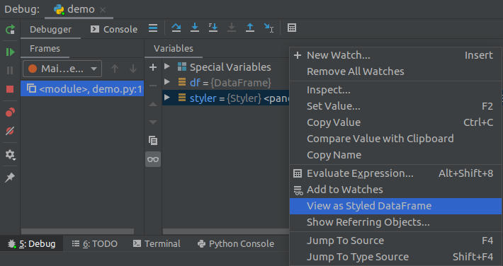
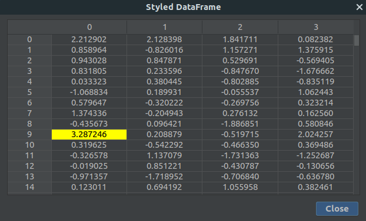
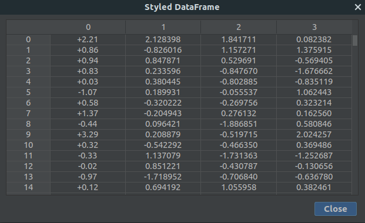
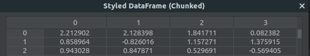
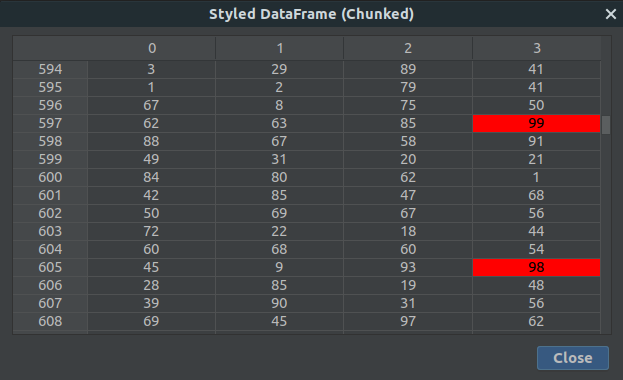
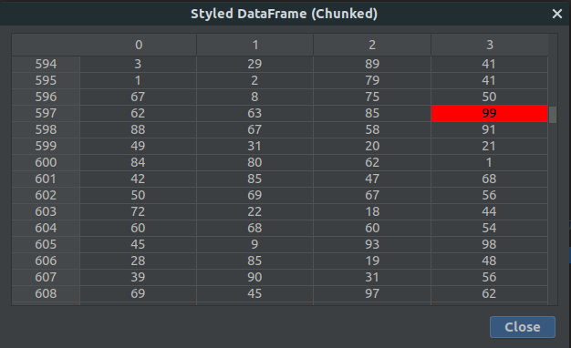

# Python: Styled DataFrame Viewer

:warning:
The **plugin is currently a beta version**, and some features might not always work as expected.

**The plugin will be incompatible with Pandas >= 1.3:** [Compatibility Warning](./docs/notes/compatibility_warning_pandas_1.3.md)

Download from JetBrains Marketplace: [Python: Styled DataFrame Viewer](https://plugins.jetbrains.com/plugin/16050-python-styled-dataframe-viewer)

## What It Is
View styled Pandas `DataFrames` when debugging.

Apply conditional formatting and visual styling in your python code, by using `DataFrames.style`.
The configured style is used to render a styled output of the `DataFrame`.


## General Information
#### I Need Your Feedback
Before adding new features I need feedback about how the current version performs and its stability.
If you discover a problem, please let me know by opening an issue in this repo or contact me on twitter ([@rendner](https://twitter.com/rendner)).

#### About The Code Snippets
All code snippets on this page are intentionally chosen very minimalistic to demonstrate the possibilities of the plugin.

The `breakpoint()` command in the snippets require at least Python 3.7. For older versions of Python replace that command
with something like `my_breakpoint` and set a breakpoint via IntelliJ on that line.

#### Supported Styler Methods
The following `Styler` methods are supported and should work:
- `Styler.highlight_min`
- `Styler.highlight_max`
- `Styler.highlight_null`
- `Styler.background_gradient`
- `Styler.set_properties`
- `Styler.apply`
- `Styler.applymap`
- `Styler.format`

#### MultiIndex DataFrames
MultiIndex `DataFrames` are currently not supported.

## How Does It Work
Generate a `DataFrame` and configure the `Styler` returned by `DataFrame.style`:
```python
import numpy as np
import pandas as pd

np.random.seed(123456789)

# create a DataFrame
df = pd.DataFrame(np.random.randn(500, 4))

# the Styler highlights the maximum value in each column
styler = df.style.highlight_max(axis='index')

breakpoint()
```
When you run the code in debug mode in IntelliJ, the program stops at the line with the `breakpoint()` command.

Select the `Debugger` tab (as seen in the screenshot below). Now you can see all the variables of the current stackframe listed. In our case the variables 
`df` and `styler`. Right click on `styler` to open the context menu. Select `View as Styled DataFrame`.



This opens a new window which shows the styled output of the `DataFrame` `df` using the configured `styler`:



You can also right click on the `df` in the `Debugger` and select `View as Styled DataFrame`. In that case all values are displayed without applied styles.

> If your `DataFrame` has more than 500 rows you have to take extra care when using custom style methods.
> Please read section: [Working With Large DataFrames](#working-with-large-dataframes)


## How To Style
A very good overview about styling a `DataFrame` can be found on the Pandas website: [Pandas User Guide: Styling](https://pandas.pydata.org/pandas-docs/stable/user_guide/style.html)

### Supported CSS Properties
The following css-properties are supported by the plugin:

|css-property|mapping|
|---|---|
|`color`|table cell text color|
|`background-color`|table cell background color|
|`text-align`|align cell text (supported values are: `left`, `right` and `center`)|

All other properties are ignored.

Inheritance of css properties is only partial implemented and may not work for all scenarios.
This may be improved if there are major problems with it.

### Format Displayed Values
You can also format the displayed data as you like:
```python
import numpy as np
import pandas as pd

np.random.seed(123456789)

# create a DataFrame
df = pd.DataFrame(np.random.randn(500, 4))

# the Styler formats all values of the first column
styler = df.style.format({0: '{:+.2f}'})

breakpoint()
```

Right click on styler in the `Debugger` tab to open the context menu. Select `View as Styled DataFrame`:



  
## Working With Large DataFrames

The data of large `DataFrames` is fetched in smaller parts called chunks. 
Whenever you scroll the content of the displayed `DataFrame`, the required data is loaded on demand instead of 
fetching all the data at once.

> `DataFrames` with more than 500 rows are processed in chunks. If it has fewer rows, the styled output is evaluated in one step without additional modification by the plugin.

You can easily recognize that chunks are used, in this case the title contains an additional `(Chunked)`.



### Why Chunks
Fetching the HTML output for large `DataFrames` and converting it is very time-consuming. 
In general, there are two expensive steps involved when fetching the data:
- calling the method `style.render()` on python side to generate the HTML representation of the `DataFrame`
- parsing and converting the fetched data in the plugin

Fetching the styled `DataFrame` in chunks is way faster and less memory consuming than fetching the whole content at once.

### Handle Chunks In Your Python Code
Loading data in smaller amounts is great, as it allows you to view larger data.
But of course there is one problem when it comes to custom style functions.

#### The Problem
In general, you pass your custom style function into one of the following methods:

  - `Styler.applymap`
  - `Styler.apply`

Both of those methods take a function (and some other keyword arguments) and applies your function to the `DataFrame` in 
a certain way. `Styler.applymap` works through the `DataFrame` elementwise. `Styler.apply` passes each column or row into 
your `DataFrame` one-at-a-time or the entire table at once, depending on the axis keyword argument.

In case of chunks, a passed column or the entire table are taken from the chunk and not from the original `DataFrame`. This
leads to problems if you want for example highlight the largest value in each column of a `DataFrame`. Because now you
can't get this value if your custom styler gets only a small part of the `DataFrame`.

The following builtin styles are automatically handled by the plugin and can therefore be used without any changes:
- `Styler.highlight_min`
- `Styler.highlight_max`
- `Styler.highlight_null`
- `Styler.background_gradient`
- `Styler.set_properties`

##### The Problem (Example)
```python
import numpy as np
import pandas as pd

np.random.seed(123456789)

# create a DataFrame
df = pd.DataFrame(np.random.randint(1, 100, size=(2800, 4)))


def my_highlight_max(series):
  is_max = series == series.max()
  return ['background-color: red' if cell else '' for cell in is_max]


# the Styler highlights the maximum value in each column
# (spoiler: at least we expect this)
styler = df.style.apply(my_highlight_max, axis='index')

breakpoint()
```
Right click on styler in the `Debugger` tab to open the context menu. Select `View as Styled DataFrame`:



You can clearly see that in column `3` we have two different values highlighted, which is wrong.

##### Solving The Problem
You can signal the plugin that you need also the un-chunked part which is normally used when calling your custom style 
function. To do this we have to adjust our custom style function `my_highlight_max`.
```python
import numpy as np
import pandas as pd

np.random.seed(123456789)

# create a DataFrame
df = pd.DataFrame(np.random.randint(1, 100, size=(2800, 4)))


def my_highlight_max(series, chunk_parent=None):
    max = (series if chunk_parent is None else chunk_parent).max()
    return ['background-color: red' if cell == max else '' for cell in series]


# the Styler highlights the maximum value in each column
styler = df.style.apply(my_highlight_max, axis='index')

breakpoint()
```
We use an optional argument named `chunk_parent`. The name of this argument has to be `chunk_parent`, otherwise the 
plugin can't detect that the un-chunked data should be provided.

> The optional argument `chunk_parent` is only provided by the plugin if the `DataFrame` is processed in chunks. Therefore, we have to use a conditional expression like `(series if chunk_parent is None else chunk_parent).max()` in our example.

Right click on styler in the `Debugger` tab to open the context menu. Select `View as Styled DataFrame`:



You could also use `**kwargs` to tell the plugin that you want to have the un-chunked data.

```python
def my_highlight_max_using_kwargs(series, **kwargs):
    max = kwargs.get("chunk_parent", series).max()
    return ['background-color: red' if cell == max else '' for cell in series]
```

Theoretical you could also use a positional argument (**don't do this**): 
```python
def my_highlight_max_not_recommended(series, chunk_parent):
    max = (series if chunk_parent is None else chunk_parent).max()
    return ['background-color: red' if cell == max else '' for cell in series]
```
However, I would strongly advise against this, since the argument is only
passed by the plugin when the `DataFrame` is processed in chunks.

##### Solving The Problem (Optional)
In some situations it isn't a good approach to recalculate time-consuming tasks again and again for each chunk.
Especially when the result is always the same as in the previous example where we called `chunk_parent.max()`.

Let's say our `DataFrame` has 10.000 rows and each chunk contains 200 rows. Then we would run `chunk_parent.max()` 
50 times for each column (in case we try to see all 10.000 rows).

Here is an example of how to reduce the number of recalculations to one per column. The code uses a dictionary named 
`max_cache` to cache already calculated values.

```python
import numpy as np
import pandas as pd

np.random.seed(123456789)

# create a DataFrame
df = pd.DataFrame(np.random.randint(1, 100, size=(2800, 4)))


def my_highlight_max(series, max_cache, **kwargs):
    if series.name not in max_cache:
        print(f"fetching max-value for column {series.name}")
        max_cache[series.name] = kwargs.get("chunk_parent", series).max()

    max = max_cache.get(series.name)
    return ['background-color: red' if cell == max else '' for cell in series]


# the Styler highlights the maximum value in each column
styler = df.style.apply(my_highlight_max, axis='index', max_cache={})

breakpoint()
```
Right click on styler in the `Debugger` tab to open the context menu. Select `View as Styled DataFrame`.

If you scroll through the chunked `DataFrame` in the window you will see in the console output in IntelliJ that the max value was 
calculated only once per column:
```
fetching max-value for column 0
fetching max-value for column 1
fetching max-value for column 2
fetching max-value for column 3
```

## Where Is The Code
I'm not sure at this point if I'm going to release the code as open source.
The code is currently more a proof of concept.

## Used Libraries
- AWT Color Factory (https://github.com/beryx/awt-color-factory)
- jsoup: Java HTML Parser (https://github.com/jhy/jsoup)
- CSS Parser (http://cssparser.sourceforge.net/)
