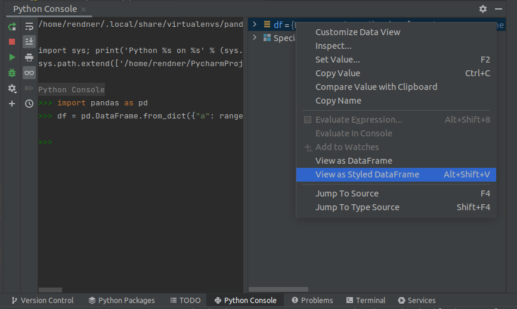
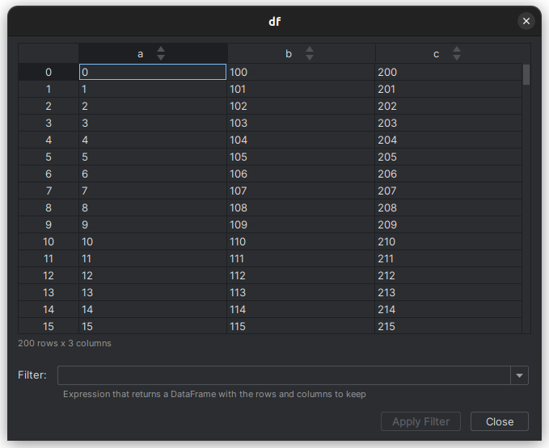

# Python: Styled DataFrame Viewer

> [!WARNING]  
> The plugin is broken in PyCharm 2024.2.1, because of a bug in PyCharm.
> 
> You can use the following workaround until the bug is fixed: [plugin fix](./docs/FIX_PLUGIN_PY_CHARM_2024.2.1.md)

## Installation

- Using the IDE built-in plugin system:

  <kbd>Settings/Preferences</kbd> > <kbd>Plugins</kbd> > <kbd>Marketplace</kbd> > <kbd>Search for "Styled DataFrame Viewer"</kbd> >
  <kbd>Install</kbd>


- JetBrains Marketplace:

  https://plugins.jetbrains.com/plugin/16050-python-styled-dataframe-viewer


## What It Is
View, sort and filter `DataFrames` or a Python `dict` when debugging.

Note: The plugin requires one of the supported Python DataFrame libraries:
- `pandas`
- `polars`


## Supported DataFrame Libraries
- [pandas DataFrame](./docs/PANDAS_DATAFRAME.md)
- [polars DataFrame](./docs/POLARS_DATAFRAME.md)

## Features
- filtering
- sorting
- [keyboard shortcuts to work efficiently](./docs/KEYBOARD_SHORTCUTS.md)
- [settings to configure plugin behavior](./docs/SETTINGS.md)

## How Does It Work
The plugin can be used to view DataFrames from a `Debug Session` or a `Python Console`.

### Quick Example: Debug Session
Generate a `DataFrame`:
```python
# code for pandas
import pandas as pd

df = pd.DataFrame.from_dict({"a": range(200), "b": range(100, 300), "c": range(200, 400)})

breakpoint()
```

```python
# code for polars
import polars as pl

df = pl.from_dict({"a": range(200), "b": range(100, 300), "c": range(200, 400)})

breakpoint()
```

Run the code in debug mode in your JetBrains IDE. The program stops at the line with the `breakpoint()` command.

Select the `Threads & Variables` tab of the debugger (as seen in the screenshot below).
Right-click on `df` to open the context menu. Select `View as Styled DataFrame`.


This opens a new window which shows the `DataFrame` `df`:


### Quick Example: Python Console
Enter the code to generate a `DataFrame`:
```python
# code for pandas
import pandas as pd

df = pd.DataFrame.from_dict({"a": range(200), "b": range(100, 300), "c": range(200, 400)})
```

```python
# code for polars
import polars as pl

df = pl.from_dict({"a": range(200), "b": range(100, 300), "c": range(200, 400)})
```

Right-click on `df`, in the variable view, to open the context menu. Select `View as Styled DataFrame`.



This opens a new window which shows the `DataFrame` `df`:


