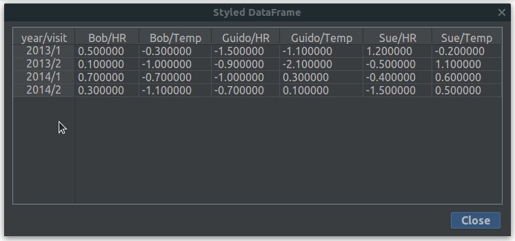
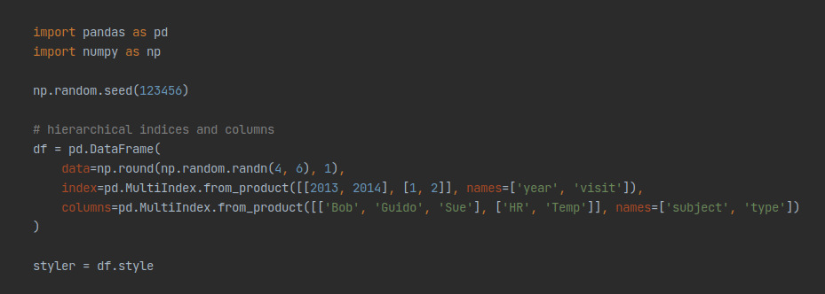

# Version 0.4.0

July, 2021

### Notable Changes

* Initial support for pandas 1.3
* Header tooltips for multi index `DataFrames`
* plugin logo added
* Compatibility with IntelliJ 2021.2
* Upgrade dependency `jsoup` to 1.14.1

#### Bug fixes
* wrong calculated multi index label in table header

### Supported pandas Versions
* 1.1.x
* 1.2.x
* 1.3.x (new in this version)

### Min Required IntelliJ Version
* 2020.3

## What's New

#### Initial Support For pandas 1.3
Support for pandas 1.3 (released on July 2, 2021) added. The following `Styler` methods are supported:
- `Styler.apply`
- `Styler.applymap`
- `Styler.background_gradient`
- `Styler.format`
- `Styler.highlight_between`
- `Styler.highlight_max`
- `Styler.highlight_min`
- `Styler.highlight_null`
- `Styler.highlight_quantile`
- `Styler.set_properties`
- `Styler.text_gradient`

#### Header Tooltips For Multi Index DataFrames
Index names of multi index `DataFrames` are now included in the header tooltip.

Code of the multi index `DataFrame` example:

