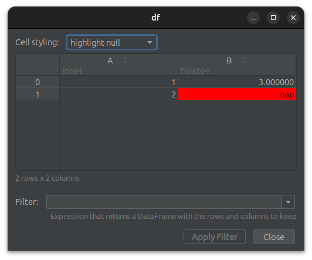
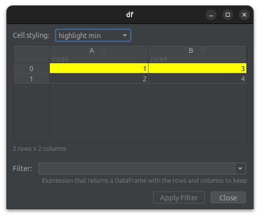
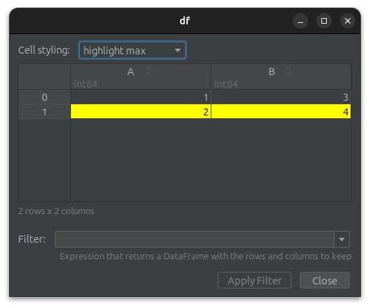
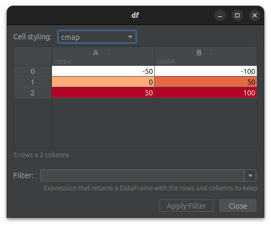
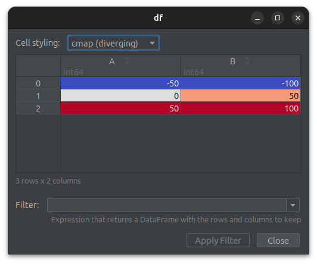

# Cell Styling
*Since Version: 0.19.0*


The plugin provides the following common cell styling to highlight numeric values of a column:

- `highlight null`: for use with identifying missing data
- `highlight min`: for use with identifying minimum in data.
- `highlight max`: for use with identifying maximum in data.
- `color map`: for highlighting cells based on their values on a numeric scale.
- `color map (diverging)`: for highlighting cells based on their values on a numeric scale.

The different cell styles can be selected via the drop-down menu labeled `Cell style` above the rendered cells.
A default styling can be configured in the [Plugin Settings](SETTINGS.md).

## highlight null
Highlights missing values.

```python
# code for pandas
import numpy as np
import pandas as pd

df = pd.DataFrame({'A': [1, 2], 'B': [3, np.nan]})

breakpoint()
```

```python
# code for polars
import polars as pl

df = pl.from_dict({'A': [1, 2], 'B': [3, float("nan")]})

breakpoint()
```



## highlight min

Highlights the minimum in each column.

```python
# code for pandas
import pandas as pd

df = pd.DataFrame({'A': [1, 2], 'B': [3, 4]})

breakpoint()
```

```python
# code for polars
import polars as pl

df = pl.from_dict({'A': [1, 2], 'B': [3, 4]})

breakpoint()
```



## highlight max

Highlights the maximum in each column.

```python
# code for pandas
import pandas as pd

df = pd.DataFrame({'A': [1, 2], 'B': [3, 4]})

breakpoint()
```

```python
# code for polars
import polars as pl

df = pl.from_dict({'A': [1, 2], 'B': [3, 4]})

breakpoint()
```



## color map

Highlights cells based on their values in each column.

Uses a sequential color map to represent data that progresses from low to high values.
Should be used when the data has a natural order or progression, and you want to emphasize the magnitude or intensity of the values.

### used colors
- `minimum`: white
- `maximum`: red


```python
# code for pandas
import pandas as pd

df = pd.DataFrame({'A': [-50, 0, 50], 'B': [-100, 50, 100]})

breakpoint()
```

```python
# code for polars
import polars as pl

df = pl.from_dict({'A': [-50, 0, 50], 'B': [-100, 50, 100]})

breakpoint()
```



## color map (diverging)

Highlights cells based on their values in each column.

Uses a diverging color map to emphasizes both high and low values while de-emphasizing the midpoint, often zero.
Should be used when the data has a critical midpoint value, such as when showing deviations above or below an average or zero.

### used colors
- `minimum`: blue
- `midpoint`: white
- `maximum`: red


```python
# code for pandas
import pandas as pd

df = pd.DataFrame({'A': [-50, 0, 50], 'B': [-100, 50, 100]})

breakpoint()
```

```python
# code for polars
import polars as pl

df = pl.from_dict({'A': [-50, 0, 50], 'B': [-100, 50, 100]})

breakpoint()
```

