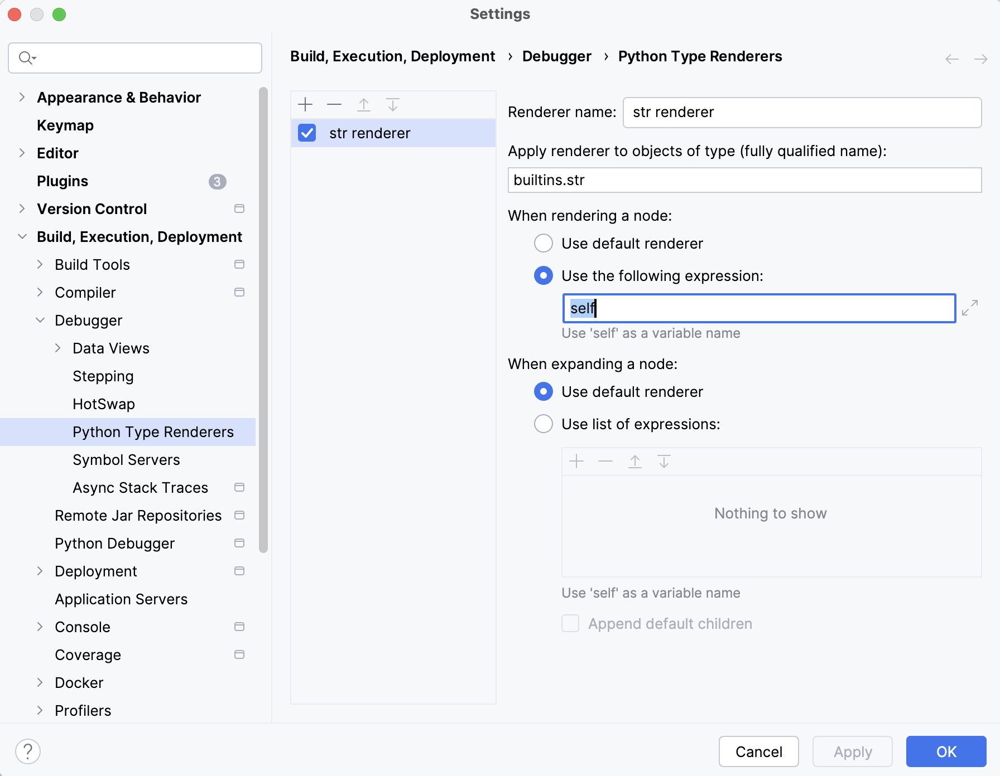

> [!NOTE]
> The bug was fixed in PyCharm `2024.2.3`.

## Fixing Non-Working Plugin
PyCharm 2024.2.1 has a bug which makes the plugin unusable.
The plugin isn't able to fetch the required data from the underlying Python process and stays empty.

### Workaround
As the plugin only loads the required data in the form of strings, you can easily configure a `custom type renderer` as a temporary workaround until the behavior is fixed in PyCharm.
These steps have only to be done once to configure such a renderer.
Afterward the plugin works again as expected.

#### Steps
- start a debug process
- evaluate an empty string `""`
- right-click at the evaluated result and select `Customize Data View` from the context menu
- the `Python Type Renderers` page of `Settings` with a new renderer opens. Configure it shown in the screenshot:

More general information about `Python Type Renderers` can be found here:
https://www.jetbrains.com/help/pycharm/customizing-views.html
