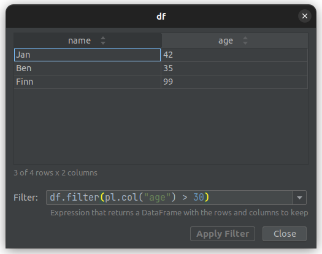

# Filtering
*Since Version: 0.17.0*

A common operation in data analysis is to filter values based on a condition or multiple conditions. 
Polars provides a variety of ways to filter a `DataFrame`.

The plugin provides a filter input field where you can enter a Python expression which returns a `DataFrame`.
The returned `DataFrame` defines which values should be displayed, others are filtered out.

## Example
Let's start with a simple example to demonstrate how you can filter your data.
Paste the code below into a new Python file and start the debugger:
```python
import polars as pl

df = pl.DataFrame({
    'name': ['Jan', 'Regina', 'Ben', 'Finn'],
    'age': [42, 29, 35, 99],
})

breakpoint()
```
Select the variable `df` in the debugger tab.
Right-click on `df` to open the context menu. Select `View as Styled DataFrame`.

This is the result of the code snippet:


You can enter any other expression as long as it returns a `DataFrame`:




## The Table State
Filtering can modify the visual state of the table displayed in the dialog.
Each time a new filter result is displayed, the plugin tries to keep the state of the columns and the 
scroll positions of the previously displayed result.

Table columns which where present before the applied filter will have the same width and sort state.
If you accidentally filter out a column that had a sort status, that status is lost.
Even if you correct the filter to add this column back.

Filtering out columns that have a sorting status leads to an update of the sorting.
This sorting contains only the columns that have a sorting status and were not filtered out.

The scroll position is not reset when updating the table with the new filter result.
So it may happen that previously visible columns, which were not excluded from the filter,
are located at a different position in the table because columns to the left of these columns were filtered out.

## The Filter Input
The filter input is a simplified editor component with syntax highlighting support, code completion and error reporting.


You can apply your filter by clicking on the `Apply Filter` button or by pressing the <kbd>Enter</kbd>-key.

### Long Filter Queries
Since the filter input is only a single line it can be tedious to enter expressions with long variable names:


In such a case you can use the special identifier `_df`, which is only available if there is no other variable named `_df`.


The identifier `_df` is rendered grayed out to indicate that this is the special identifier provided by the plugin.
It is also provided in the code completion of the filter input.

### Code Completion
The filter input provides code completion to help you to complete methods or fields of a `DataFrame`.
The plugin adds additional code completion to simplify the use of the filter input.

#### Python Console
The filter input for the Python Console uses runtime code completion.

Runtime code completion is based on the runtime state of the application.
It uses the types, methods, and variables that are currently active in the memory during the execution of the program.

Runtime code completion may lead to certain side effects, such as unintentional code execution without an explicit user input.
For example, the class property initialization code will be called immediately after the user enters `.` to get the list of class attributes.

> [!Note]
> This completion can be disabled in the plugin settings under:
> *Filter input* | *Runtime code completion (Python Console)*
>
> The synthetic identifier `_df`, which refers to the viewed `DataFrame`, does not use runtime code completion.
> Therefore, code completion is provided for `_df` even if this option is disabled.
