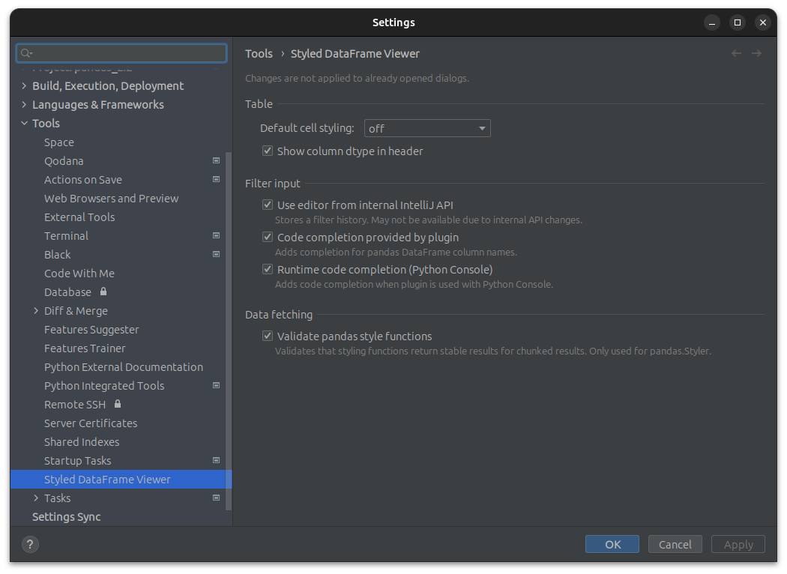

# Settings
Settings persistently store states that control the behavior and appearance of the plugin.
Changes to the settings are not applied to `Styled DataFrame Viewer` dialogs that are already open.

To adjust the settings of the plugin, open **Preferences** of your Jetbrains IDE for macOS or **File | Settings** for Windows and Linux.
Alternatively, press <kbd>Ctrl</kbd> + <kbd>Alt</kbd> + <kbd>S</kbd>.

In the settings dialog select **Tools > Styled DataFrame Viewer**

> The plugin settings are global and apply to all existing projects of the current IntelliJ IDEA version.

## Data fetching

### Validation strategy (pandas only)

> Please read [Validating Style Functions](VALIDATING_STYLE_FUNCTIONS.md)

There are two different strategies to validate that the styling functions of a styled pandas `DataFrame` work correctly when applied to chunks.
If the performance is good enough for you, use the strategy `Precision`.

#### Strategy: Precision
Divides the fetched chunk into 4 smaller parts, by bisecting the chunk horizontally AND vertically.
For each part and styling function an internal representation is generated and combined.
The combined result is compared against the internal representation of the chunk for the current checked styling function.

#### Strategy: Fast
Divides the fetched chunk into 2 smaller parts, by alternately bisecting the chunk horizontally OR vertically.
For each part and styling function an internal representation is generated and combined.
The combined result is compared against the internal representation of the chunk for the current checked styling function.

Alternating bisecting of the chunk means that the algorithm switches between horizontal and vertical after fetching a chunk.
This can lead to the fact that for the same `DataFrame`, once errors are reported and another time not.
This depends on whether the error can be detected when the fetched chunk is split horizontally or vertically during the validation.

This Strategy does half of the work of the strategy `Precision`, therefore it is faster.

## Feature switches
Enable/disable experimental or unsupported features.
