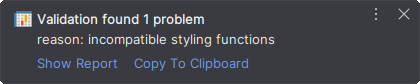

# Validating Style Functions

> This is currently an experimental feature. Please report any problem (create an issue).
> This will help to improve the quality and stability of this feature.

As mentioned in [README.md](../README.md#handle-chunks-in-custom-styles) the user has to take some extra care to
ensure that custom styling functions behave correctly. 

The problem is, how can I recognize that the displayed styled values are not correct?

One could do the following (pseudo algorithm):

- create all styled values for the `DataFrame` by using your styling function
- create all styled values for all disjunctive chunks (a chunk is a smaller 2d area of a `DataFrame`)
- compose the styled values of the chunks so that they form the same 2d shape as the `DataFrame`
- compare the composite styled values of the chunks with the styled values of the `DataFrame`

This is a lot of work, especially for a large `DataFrame`. 
And this might have to be done not only for one `DataFrame`, but for many ones to be sure that it works (depends on the complexity of the styling function).

## Support From The Plugin
The plugin provides an automatic validation by using a similar algorithm as described above.

Whenever a chunk is fetched from a `DataFrame`, the plugin can validate the data of the fetched chunk afterwards in the background.
> Note: The validation **can't** ensure that the combined output of all chunks of a `DataFrame` is the same as the output of the `DataFrame`.
> This would require to generate the HTML for the whole `DataFrame` at once which isn't doable in realtime.
> It can only guarantee that the combined output of smaller 2d parts, taken from the fetched chunk, match with the output of the fetched chunk.
> 
> I expect that the current implementation can already provide good guidance.

A short video to demo the feature, taken from an earlier PoC, can be found here: [Validation Demo](https://twitter.com/rendner/status/1530298351698296833?s=20&t=6wXXchcZvLfHJK5ZndpNFA)

### Things To Keep In Mind:

- Evaluation and validation of a chunk takes place on the Python side and must be performed sequentially.
  Because, the internal data structure of pandas `DataFrame` and `Styler` are not threadsafe - performing both steps at the same time would result in unexpected results.

- The number of styling functions used (less is better) to style a `DataFrame` can greatly affect the duration of validation.
  In case of an error, the plugin tries to identify the styling functions which caused the non-matching values.
  To do this, it has to do all the validation steps for each styling function.

- Fetching the next chunk of a `DataFrame` can only be done after the previous chunk has been fetched and its validation has been completed.

- By the plugin reported errors indicate that a styling function produce different output for different sizes of chunks.
  However, this does not mean that the values just displayed for the chunk are wrong. 
  Smaller parts of the chunk were used for the validation and these parts combined didn't match with the styled values of the fetched chunk.
  The error, detected by the plugin, can therefore not be found in the displayed data.

## Configure Validation
Validation is **disabled** by default.

> The plugin settings are global and apply to all existing projects of the current IntelliJ IDEA version.

To configure the validation you have to open the settings dialog, select *IntelliJ IDEA | Preferences* for macOS or *File | Settings* for Windows and Linux.
Alternatively, press `Ctrl+Alt+S`. 

Under the section `Tools` you will find the entry `Styled DataFrame Viewer`.

There are two different strategies to validate the styling functions of a styled `DataFrame`.
If the performance is good enough for you, I would recommend to use the strategy `Precision`.

> Changing the validation strategy only affects viewer-dialogs opened afterwards, viewer-dialogs already opened use the strategy that was configured when the dialog was opened.

### Strategy: Precision
Divides the fetched chunk into 4 smaller parts, by bisecting the chunk horizontally AND vertically.
For each part and styling function an internal html representation is generated and combined. 
The combined result is compared against the internal html representation of the chunk for the current checked styling function.

### Strategy: Fast
Divides the fetched chunk into 2 smaller parts, by alternately bisecting the chunk horizontally OR vertically.
For each part and styling function an internal html representation is generated and combined.
The combined result is compared against the internal html representation of the chunk for the current checked styling function.

Alternately bisecting the chunk means that, bisecting is toggled between horizontally and vertically after fetching a chunk.
This can lead to the fact that for the same `DataFrame`, once errors are reported and another time not. 
This depends on whether the error can be detected when the fetched chunk is split horizontally or vertically during the validation.

This Strategy does half of the work of the strategy `Precision`, therefore it is faster.

## Notifications
Whenever an incompatible styling function is detected a balloon notification is displayed.
These notifications are also gathered in the *Event Log* tool window of IntelliJ and can be reviewed later.

The notification provides a `Show Report` and a `Copy To Clipboard` action.

### Action: Show Report
Opens a small info dialog in which the warnings/errors found are listed.

All styling functions which raised an exception during the validation process are reported as warnings since it could not be determined if they really give different results for different sizes of chunks.
Nevertheless, this indicates a problem when a styling function raises an exception only for some chunks.

All styling functions that produce different output for different sizes of chunks are reported as errors.

The following information is provided to identify the function that may be faulty:

| property        | description                                                                                          |
|-----------------|------------------------------------------------------------------------------------------------------|
| reason          | A short description why a styling function is reported.                                              |
| index           | The index of the styling function in `Styler._todo`.                                                 |
| func-name       | The name of the styling function.                                                                    |
| func-qname      | The qualified name of the styling function. Only if it differs from the `func-name`.                 |
| pandasBuiltin   | True, if it is a pandas builtin styling function. Only for pandas builtin styling functions.         |
| isSupported     | True, if the styling function is supported by the plugin. Only for pandas builtin styling functions. |
| arg-chunkParent | True, if the styling function already uses the `chunk_parent` parameter.                             |
| arg-axis        | The used axis of the styling function. Only for `Styler.apply`.                                      |

### Action: Copy To Clipboard
Copies a simplified report string into the clipboard.

This can be used to create a GitHub-Issue.
However, the information it contains alone is not sufficient for this purpose.
It would be very helpful to provide also a minimal code example.